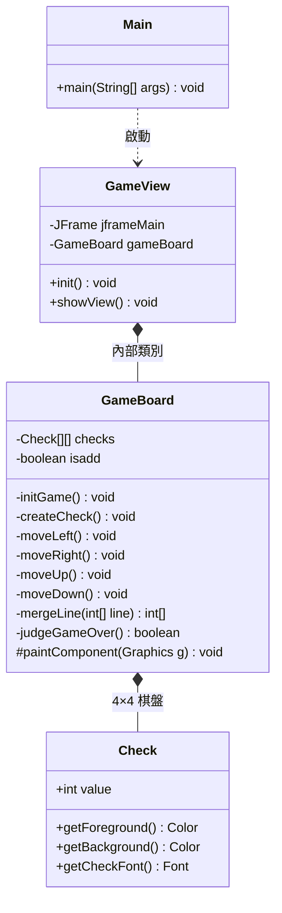

# Java 2048 程式架構

以下依目前取得的 `GameView.java` 與先前提供的三個原始檔案整理。`Main.java`、`Check.java` 的最新 package 宣告尚待確認。

```mermaid
classDiagram
    class Main {
        +main(String[] args) void
    }
    class GameView {
        -JFrame jframeMain
        -GameBoard gameBoard
        +init() void
        +showView() void
    }
    class GameBoard {
        -Check[][] checks
        -boolean isadd
        -initGame() void
        -createCheck() void
        -moveLeft() void
        -moveRight() void
        -moveUp() void
        -moveDown() void
        -mergeLine(int[] line) int[]
        -judgeGameOver() boolean
        #paintComponent(Graphics g) void
    }
    class Check {
        +int value
        +getForeground() Color
        +getBackground() Color
        +getCheckFont() Font
    }
    Main ..> GameView : 啟動
    GameView *-- GameBoard : 內部類別
    GameBoard *-- Check : 4×4 棋盤
```

**註：** `GameBoard` 是 `GameView.java` 中的內部類別，並非獨立的 `GameBoard.java` 檔案。
